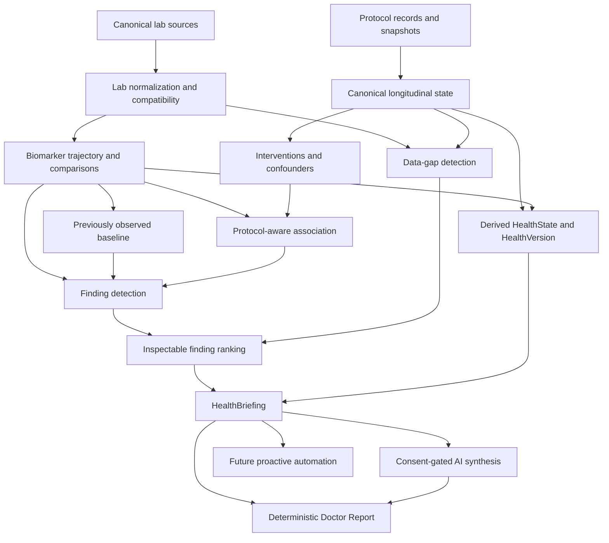

# North Star Product Architecture

Date: 2026-09-12. Status: strategy proposal, not implementation approval.

Governing standard: [Product Constitution](product-constitution.md). Delivery sequence: [Automation Roadmap](automation-roadmap.md).

Audit basis: the supplied working copy at `baseline-work/protocol-main`, including the latest lab-only longitudinal refinement. This is an extracted repository, without Git commit metadata. It was not independently matched to GitHub `main`, the production deployment, or live Supabase schema/RLS. Migration filenames are not evidence of deployment. Findings below describe inspected source, not a production certification.

## 1. Where is user work still unnecessarily manual?

| Current work | Repository evidence | Implication |
| --- | --- | --- |
| Map imports, correct rows, enter PDF panel metadata, then confirm results. | [lib/health/labImport.ts][import]: `detectColumns`, `mapCsv`, `parsePdfLines`; [components/health/ImportLabForm.tsx][import-ui]: `ImportLabForm`. | Column detection already exists. Improve proven parser gaps before proposing an entirely new ingestion system. Mixed-date CSVs need manual separation/selection; the current flow saves one panel. |
| Transcribe scanned or unsupported PDFs. | [lib/health/pdfImport.ts][pdf]: `extractPdfText` reads embedded text with bounded file/page/time limits. `ImportLabForm` invokes `parsePdfLines` without provider adapters. | OCR and tested report-specific adapters could reduce work, but neither is a prerequisite to analyzing already recorded labs. |
| Inspect biomarker charts individually and mentally assemble longer history. | [components/health/BiomarkerTrend.tsx][trend-ui]: `BiomarkerTrend`; [lib/health/biomarkerIntelligence.ts][bio]: `compareLatest`, `trendChart`. | The chart contains history, but its shared semantic comparison covers only the last pair. |
| Ask a question to obtain synthesis, then cross-check other views. | [components/health/HealthAnalyst.tsx][analyst-ui]: `HealthAnalyst`; [lib/health/analyst/evidence.ts][evidence]: `buildAnalystContext`. | Prompting remains an interaction prerequisite for AI synthesis. A future deterministic briefing should not require a question or AI consent. |
| Resolve dose ambiguity and historical gaps. | [lib/health/dosingEntry.ts][entry]: `entryFormState`, `interpretEntry`; [lib/health/longitudinal/history.ts][history]: `phasesAtDate`. | This work is justified where evidence is genuinely missing. Automating a guess would violate the constitution. |

The largest automation gap is converting existing multi-date data into a concise, consistent account without chart-by-chart work. Import correction is another concrete burden, but the repository contains no representative import-failure distribution showing that it should take precedence.

## 2. What intelligence already exists but is fragmented across surfaces?

The strongest existing asset is a functioning deterministic chain: normalized labs → dated interventions → conservative historical state → same-unit baseline/follow-up observations → confounders and coverage limits. [lib/health/longitudinal/engine.ts][engine] `buildLongitudinal` already derives `HealthVersion` periods; [lib/health/longitudinal/analyst.ts][long-ai] projects the same comparable lab observations for protocol-context Analyst requests. Do not rebuild this as a separate health-state platform.

Concrete fragmentation:

| Capability | Current differences |
| --- | --- |
| Comparison eligibility | [biomarkerIntelligence.ts][bio] `compareLatest` rejects any duplicate on either comparison date. [longitudinal/engine.ts][engine] `observation` accepts equal-valued duplicates, rejects conflicting ones, and retains a representative reading. Same-unit arithmetic exists in both; their purposes/windows are intentionally different. |
| Arithmetic and ordering | `compareLatest` permits percentage calculation for nonzero negative baselines using absolute magnitude; `observation` permits it only for positive baselines. [analyst/evidence.ts][evidence] `rankedComparisons` extracts percentages from formatted prose; [report/model.ts][report] `buildDoctorReport` orders typed comparisons by flag, absolute percentage, and date. Neither is an inspectable shared finding-priority contract. |
| Range transitions and coverage | `buildAnalystContext` computes newly measured, absent-from-latest-panel, newly flagged, and returned-to-range facts locally. Its newly-flagged condition accepts any previous non-flagged status, including `unknown`. These statements bypass `compareLatest`'s duplicate-date eligibility checks. [biomarkerIntelligence.ts][bio] `labIntelligence` instead reports latest flags and category/repeat counts. |
| Historical regimen | Protocol-context Analyst uses [longitudinal/history.ts][history] `healthStateAtDate`; other Analyst intents, Doctor Report, and test-date overlays use [protocolOverlay.ts][overlay] `contextAtDate`. The older resolver treats the completion date as inclusive and uses ID ordering for tied lifecycle dates; the newer resolver uses exclusive completion and rejects conflicting same-day states. |
| Report context | [report/model.ts][report] `protocolLabContext` finds markers within 30 days of panels. That is a proximity list, not the longitudinal engine's 90-day baseline / days 1–84 follow-up comparison. [report/service.ts][report-service] `createDoctorReportFromSource` asks for “current protocols”, which `classifyAnalystIntent` classifies as `current_snapshot`; it does not automatically obtain the new protocol-context projection. |

These are reasons to consolidate policies and typed evidence, not reasons to make every surface show the same window or list.

## 3. What deterministic foundations are missing?

Missing capabilities are extensions to working modules:

- A reusable comparison result that explains eligibility, exclusions, dates, unit/assay uncertainty, and all contributing source IDs. `compareLatest` currently returns a pair or `null`; `observation` has richer limits but a different representation. See [biomarkerIntelligence.ts][bio] `BiomarkerComparison` and [longitudinal/types.ts][long-types] `LongitudinalObservation`.
- Full-series facts: latest-versus-earliest, ordered successive movements, prior observed extent, and range-transition persistence. `trendChart` is chart geometry, not this domain model; the local transition loop in `buildAnalystContext` is not a complete trajectory implementation.
- Deterministic findings and priority reasons shared across consumers. Current [analyst/types.ts][analyst-types] `ContextFact` is text plus citations, while Analyst findings are provider output validated by [analyst/schema.ts][schema] `validateHealthAnalysis`. Neither should become the canonical factual store.
- A single historical-context policy for cross-surface use. Promote `healthStateAtDate` through explicit adapters after parity tests; do not add another resolver. This consolidation is a later dependency for wider protocol-aware briefing, not a reason to broaden the immediate lab foundation.

Current `HealthVersion` is already derived. A new persisted HealthState/HealthVersion table is not a missing prerequisite.

## 4. What data, provenance, normalization, or historical-state limitations block trustworthy automation?

| Limitation | Exact evidence and boundary |
| --- | --- |
| Assay/preparation comparability is not established by name and unit alone. | [labs.ts][labs] `LabResult` has no typed assay, method, specimen, or fasting field; [Labs V1 migration][labs-sql] `public.lab_results` has none either. [biomarkerIntelligence.ts][bio] `classifyBiomarker` separates sensitive estradiol and LDL-P, but groups glucose with fasting glucose and LDL-C with calculated LDL aliases. Unknown method must remain unknown; never certify interchangeability from an alias. |
| Stored alias fields are not the active normalization authority. | [labs.ts][labs] `biomarkerHistories` calls `classifyBiomarker(result.biomarker_name)`, not `canonical_name`. Do not build a second registry around a mostly unused column or overwrite raw labels. |
| Provenance exists, but is not a complete document/correction ledger. | [Labs V2 migration][labs-v2-sql] `labs_v2_audit_guard` preserves original source metadata/raw rows during edits; `save_lab_panel_v2` checks `updated_at` and ownership. Corrected result values themselves are mutable; removed rows are deleted. [labImport.ts][import] stores parser/mapping/row or extracted-line provenance, not the original PDF binary. Original import confidence is not clinical confidence or a full correction history. |
| Derived measurements carry only part of available provenance. | [longitudinal/measurements.ts][measurements] `normalizeMeasurements` retains original name/value/unit, result and panel IDs, and ranges. It does not project `import_confidence`, assay metadata, or every member of an equal-valued same-day group. A future finding must retain all contributing references without sending raw import text to AI. |
| Historical plans cannot always be replayed. | [Structured events migration][events-sql] `protocol_phase_event_state_v1` records dose entry, frequency, route, and week bounds, but not schedule days/times. `save_protocol_with_events_v1` emits changes for dose fingerprint, frequency, and route, not boundary-only edits. Preparation-only changes are outside its dose fingerprint. |
| Some lifecycle mutations bypass historical events. | [app/protocol/manage/page.tsx][manage] `reactivateProtocol` directly sets `status='active'` and clears `completed_date`. [Advisory dosing migration][entry-sql] `save_protocol_dosing_v2` deletes explicitly removed compounds; the structured wrapper loops surviving phases without emitting a removal snapshot. Missing past data cannot be manufactured by a new resolver. |
| Logs establish recorded completion, not exact historical administered dose. | [app/protocol/page.tsx][today-page] `toggleInjection` writes user, compound, date, taken, and discomfort, keyed by user/compound/date. This path does not preserve a medication-dose snapshot or multiple administration times that day. Do not infer verified exposure/adherence from a saved schedule. |
| Loaded scope is bounded. | [analyst/context.ts][context] `loadHealthSourceData` caps protocols at 250 and events/journal rows at 1,000. [longitudinal/engine.ts][engine] caps displayed interventions at 60, observations at 200, and periods at 120; confounders use all loaded changes. [loadLabs.ts][load-labs] `readLabPanels` paginates lab rows. “No observation found” must respect loading limits. |
| Privacy and ownership are real architectural boundaries. | [Labs V1 migration][labs-sql] uses owner RLS and the `(lab_panel_id,user_id)` foreign key; [aiConsent.ts][consent] `hasCurrentAiConsent` uses [userProfileOwnership.ts][ownership] `resolveUserProfileOwnership` for `id`/`user_id` variants. The base profile/table creation policies are not fully defined in these incremental migrations, so live RLS cannot be certified here. |

Keep [health-analyst POST][analyst-route] consent and durable limiting before source loading. [health-report POST][report-route] checks consent only when AI is requested; its deterministic path remains available. [durableRateLimit.ts][limiter] `checkDurableRateLimit` fails closed in production. [monitoring.ts][monitoring] `buildOperationalEvent` and [analyst/monitoring.ts][ai-monitor] record sanitized operational classifications, not health payloads. [api/account DELETE][account] and [Launch Blockers migration][launch-sql] `delete_my_account_data_v1` must cover any future stored owner data; this proposal adds none.

## 5. Which current product surfaces create noise, cognitive burden, or unnecessary complexity?

- **Protocol Changes:** [LongitudinalChanges.tsx][changes-ui] already filters to comparable labs and renders one empty state. The remaining flat `protocolChangeOptions` selector can still expose up to 60 individual changes. Future primary grouping should use protocol/compound record identity and explicit episode links, with intervention ID as secondary selection. Preserve `change=<intervention-id>`, blends, and separate starts/stops. [manage/page.tsx][manage] already uses `continued_from_protocol_id`; labels alone must not create relationships.
- **Labs:** [LabInsights.tsx][insights-ui] and `BiomarkerTrend` expose category lists, flags, and individual histories, requiring users to assemble priority and trajectory themselves. A finding summary can eventually precede those views without replacing them.
- **Today:** [TodayOverview.tsx][today-ui] combines focus, clickable protocol rings, recent events, and journal trends. [today.ts][today] supplies current protocol and journal presentation, not a multi-lab briefing. Preserve this useful daily-action role rather than turn it into another dense analysis screen.
- **Timeline and Journal:** [loadTimeline.ts][timeline-load] deliberately combines protocol, lab, journal, and weight history; [app/journal/page.tsx][journal] edits the original journal entries. These surfaces have different jobs. Lab-only Protocol Changes is not a mandate to remove their existing data.
- **Analyst and Report:** A question-first interaction and independently reconstructed report facts increase cross-checking. Reusing evidence should precede adding another synthesis surface. See `HealthAnalyst`, `buildAnalystContext`, and `buildDoctorReport` above.

The visible event filter is a later presentation improvement, not the next foundation.

## 6. What existing code should become canonical shared infrastructure?

Disposition applies to future work, not changes made in this strategy run.

| Existing capability | Current location and symbol | Disposition | Why |
| --- | --- | --- | --- |
| Owner-scoped health reads | [lib/health/analyst/context.ts][context] `loadHealthSourceData`; [lib/health/loadLabs.ts][load-labs] `readLabPanels` | REUSE | Already shared by Report and longitudinal loading; avoid per-observation queries. Project only needed fields at consumer boundaries. |
| Normalization and unit series | [lib/health/biomarkerIntelligence.ts][bio] `classifyBiomarker`; [lib/health/labs.ts][labs] `biomarkerHistories` | EXTEND | Promote existing identity rules while explicitly representing uncertain compatibility. No new alias registry. |
| Imported raw evidence | [lib/health/labImport.ts][import] `mapCsv`, `parsePdfLines`; [lib/health/labEditor.ts][lab-editor] `duplicateRows`, `prepareLabSubmission`; [Labs V2 migration][labs-v2-sql] `labs_v2_audit_guard` | REUSE | Preserve review, original provenance, and concurrency safeguards. Exact duplicate detection is not semantic deduplication. |
| PDF extraction | [lib/health/pdfImport.ts][pdf] `extractPdfText` | EXTEND later | Retain local, bounded parsing; add adapters only against measured failure cases. |
| Numeric pair comparison | [lib/health/biomarkerIntelligence.ts][bio] `compareLatest`, `BiomarkerComparison` | EXTEND | Keep a compatible entry point while promoting typed eligibility and source references. |
| Before/after comparisons | [lib/health/longitudinal/engine.ts][engine] `observation`, `defaultWindow` | CONSOLIDATE eligibility only | Share measurement rules, preserve baseline/follow-up window semantics and confounder logic. |
| Chart geometry | [lib/health/biomarkerIntelligence.ts][bio] `trendChart`; [lib/health/protocolOverlay.ts][overlay] `overlayChart` | REUSE | Rendering is not a competing factual engine. |
| Current dosing and phase selection | [lib/health/dosingEntry.ts][entry] `interpretEntry`, `dosingDisplay`; [lib/health/dosing.ts][dosing] `currentPhase`; [phaseLifecycle.ts][phase] `expiredLatestPhase` | REUSE | Save-first interpretation and strict phase boundaries are established constraints. |
| Historical state | [lib/health/longitudinal/history.ts][history] `healthStateAtDate`, `phasesAtDate`, `medicationForPhase` | REUSE | Preferred canonical date resolver, with limitations intact. |
| Older state resolution | [lib/health/protocolOverlay.ts][overlay] `contextAtDate`, `protocolActiveOnDate` | CONSOLIDATE later | Adapt consumers to the preferred resolver with explicit completion/same-day regression tests. Retain chart/presentation helpers. |
| Interventions and identity | [lib/health/longitudinal/interventions.ts][interventions] `detectInterventions` | REUSE | Structured events and fallback provenance already exist. No name-based merging. |
| Lab-only observations, confounders, coverage | [lib/health/longitudinal/measurements.ts][measurements] `normalizeMeasurements`; [engine.ts][engine] `buildLongitudinal`; [types.ts][long-types] `EvidenceStrength` | REUSE / EXTEND provenance | Keep labs only and current timing limits. Better lineage is an extension, not a new observation engine. |
| Health Versions | [lib/health/longitudinal/types.ts][long-types] `HealthVersion`; [engine.ts][engine] `versions` | REUSE | Existing derived periods already link regimen, interventions, and measurements. |
| Comparable-list projection | [lib/health/longitudinal/presentation.ts][presentation] `comparableLabObservations`, `protocolChangeOptions`, `protocolChangeUrl` | REUSE | Shared lab-only selection, identity, linkability, and empty-state behavior. |
| Range transitions, missing measurements, ranking | [lib/health/analyst/evidence.ts][evidence] `buildAnalystContext`; [lib/health/report/model.ts][report] `buildDoctorReport`; [biomarkerIntelligence.ts][bio] `labIntelligence` | CONSOLIDATE | Promote typed facts; replace prose percentage extraction once consumers migrate. Preserve view-specific ordering purposes. |
| Evidence projection and citations | [lib/health/longitudinal/analyst.ts][long-ai] `longitudinalAnalystEvidence`; [analyst/evidence.ts][evidence] request-local `E` ID mapping | EXTEND | Project shared facts with provenance and caps; keep raw records out of provider input. |
| AI synthesis and safety | [lib/health/analyst/service.ts][service] `analyzeHealthContext`; [schema.ts][schema] `validateHealthAnalysis`; [prompts.ts][prompts] `healthAnalystSystemPrompt`; [provider.ts][provider] `createHealthAnalystProvider` | REUSE | Consent-gated synthesis over evidence, bounded provider calls, citation validation, deterministic no-data response. |
| Doctor Report | [lib/health/report/model.ts][report] `buildDoctorReport`; [service.ts][report-service] `createDoctorReportFromSource` | EXTEND | Consume shared facts; retain deterministic report and optional-AI failure fallback. |
| Today, protocol summaries, Timeline | [today.ts][today] `todayProtocols`, `journalSnapshot`; [protocolPresentation.ts][protocol-presentation] `compoundOverview`; [timeline.ts][timeline] `normalizeTimeline`, `deriveBaseline` | REUSE | Preserve their presentation roles. Do not make Timeline's mixed-source event type a lab-comparison schema. |
| Auth, consent, limiting, monitoring | [serverSupabase.ts][server] `createAuthenticatedServerClient`; [aiConsent.ts][consent] `hasCurrentAiConsent`; [durableRateLimit.ts][limiter] `checkDurableRateLimit`; [monitoring.ts][monitoring] `captureOperationalError` | REUSE | No parallel provider path or new permissions implied by automation. |

## 7. What is the dependency graph of the next major intelligence capabilities?

These are layers, not sixteen competing features. “Protocol-aware attribution” is permitted only as **association/context**. Personal observations never establish causation.

Today and other future consumers read the same derived facts. AI is optional; the deterministic Report does not depend on successful AI. Proactive automation may be deterministic; any AI branch must recheck consent and authorization at execution time.

### Minimal domain model

A = canonical persisted data; B = deterministically derived data; C = AI/presentation-time synthesis. No new tables proposed.

| Concept | Class | Existing home / proposed boundary |
| --- | --- | --- |
| Source records | A | Existing `lab_panels`, `lab_results`, `protocols`, `compounds`, `phases`, `protocol_events`, `injection_logs`, `journal_entries`. Profiles/consent remain existing controls. Journal and logs are not added to lab observations. |
| Dosing entry | A | Existing [dosingEntry.ts][entry] `DosingEntry` persisted in `phases.dosing_entry`; raw entry and review status remain authoritative inputs. |
| SourceEvidence | B | Extend existing [types.ts][long-types] `SourceRef` and `Measurement` references, not duplicate raw records. Preserve original source, parser confidence, and correction/source limitations separately. |
| TrendSeries / trajectory / comparison | B | Extend [labs.ts][labs] `BiomarkerHistory`, [biomarkerIntelligence.ts][bio] `BiomarkerComparison`; one typed derivation contract, not three storage models. |
| PersonalBaseline | B | Descriptive prior observations for a declared interval, excluding the reading being assessed. Count, dates, extent, and coverage; no personal “normal” or safety range. |
| Intervention | B | Existing [types.ts][long-types] `Intervention`, from event/phase identity via `detectInterventions`. |
| LongitudinalObservation | B | Existing type and `buildLongitudinal`; numerical labs only. No new generic journal Observation model. |
| Confounder / EvidenceStrength | B | Existing overlapping `Intervention[]` and `EvidenceStrength`. Known overlap is not a complete causal adjustment model. |
| HealthState / HealthVersion | B | `healthStateAtDate` currently yields `ProtocolState[]`; compose it with lab availability/facts as needed. Reuse existing `HealthVersion` periods, not stored patient snapshots. |
| Finding / FindingPriority / DataGap | B | Typed facts, inspectable ordering reasons, and missing-evidence conditions promoted from `buildAnalystContext` and `buildDoctorReport`. No opaque AI score. |
| HealthBriefing | C | Bounded deterministic presentation of ranked facts, with an optional consent-gated explanation. Never a new factual authority. |
| AI synthesis / Doctor Report presentation | C | Existing `analyzeHealthContext` and report service/model adapters over A/B evidence. Stored provider prose is not required. |

### Comparison and interpretation contract

| Need | Required deterministic behavior |
| --- | --- |
| Latest vs previous / earliest | Explicit comparator dates and values; full series available. Earliest means earliest loaded eligible reading, not a person's biological baseline. |
| Full trajectory | Ordered eligible readings and successive differences. Repeated direction requires multiple intervals; do not infer continuity between sparse tests. |
| Reversal / step change / stable history | Reversal can describe a sign change in recorded movements. Step/stability labels require declared, versioned rules, enough observations, and justified tolerances; absent those, show the sequence rather than invent thresholds or significance. |
| Personal observed history | Report prior dates, counts, extent, and nearest prior observations. Distinguish closeness from clinical normality. No population ranges synthesized from personal measurements. |
| Before/after intervention | Retain current baseline/follow-up windows, same-day exclusions, effective dates, historical uncertainty, and all overlapping interventions. Do not assign treatment effects. |
| Newly flagged / returned / persistent | Require known statuses and inspect supplied ranges/status provenance. Unknown prior status is not prior in-range. Changed lab ranges can invalidate a transition claim. Persistence describes repeated recorded flags, not continuous abnormality. |
| Newly / no longer measured | Compare panel membership explicitly. “Not measured in this panel” does not mean discontinued monitoring or resolved disease. |
| Units and assays | Separate incompatible units, analytes, known methods and specimen/preparation conditions. Do not infer assay equivalence. Missing assay data limits confidence; provisional same-unit arithmetic must state that compatibility is unverified and cannot support stronger labels. |
| Conflicts and missing data | Explain missing units/ranges, qualitative values, duplicate/conflicting dates, unavailable comparators, incomplete windows, and source limits. Preserve every source ID; do not average away conflicting results or silently discard provenance. |

Future ranking should order supported findings by transparent reasons: new supplied-range transition, persistent supplied flag, repeated direction/reversal, departure from prior history, recency, comparator completeness, import/source confidence, follow-up consistency, and confounding. Magnitude or percentage alone is not clinical importance; large changes from small denominators need context. A “newly measured important biomarker” requires an explicitly governed priority rule, not an AI guess or compound-name association. Stable tie-breaks must preserve identity.

The eventual briefing should answer current state, what changed, what is new/persistent/returned, prior observed context, uncertainty, and missing evidence. Each conclusion retains panel/result IDs, source label/document metadata where available, dates, values, units, supplied ranges, comparison readings, intervention/window, and confounders. “Worth discussing” should frame evidence/questions for a clinician, not direct medication changes. The provider receives only the approved, minimized projection.

## 8. What single foundational project should be built next, and why?

**Shared Lab Evidence V1: consolidate comparison eligibility and promote typed trajectory facts.**

This is the lowest useful missing layer above existing lab normalization. It extends `biomarkerHistories` and `compareLatest`, shares eligibility with longitudinal observations, and extracts local facts from Analyst/Report. It does not introduce a parallel HealthState engine. Existing normalized records can support useful, qualified facts today, while explicit gaps prevent false certainty.

The [roadmap](automation-roadmap.md) defines this one project's boundaries and challenges it against the strongest alternative: repairing ingestion and historical provenance first.

Audit validation: source and relevant regression tests were inspected, including [longitudinal.test.mjs][test-long], [labs-v2c.test.mjs][test-labs], [structured-events.test.mjs][test-events], [protocol-overlay.test.mjs][test-overlay], [health-analyst.test.mjs][test-ai], [doctor-report.test.mjs][test-report], and [iphone-qa-fixes.test.mjs][test-qa]. These mix executable synthetic cases with source/SQL assertions; they do not establish live database behavior. No application tests/build were rerun for this documentation-only strategy pass. Existing release notes in [docs/timeline.md](timeline.md) span superseded implementations; current code takes precedence.

[bio]: ../lib/health/biomarkerIntelligence.ts
[labs]: ../lib/health/labs.ts
[load-labs]: ../lib/health/loadLabs.ts
[import]: ../lib/health/labImport.ts
[pdf]: ../lib/health/pdfImport.ts
[import-ui]: ../components/health/ImportLabForm.tsx
[lab-editor]: ../lib/health/labEditor.ts
[trend-ui]: ../components/health/BiomarkerTrend.tsx
[insights-ui]: ../components/health/LabInsights.tsx
[analyst-ui]: ../components/health/HealthAnalyst.tsx
[context]: ../lib/health/analyst/context.ts
[evidence]: ../lib/health/analyst/evidence.ts
[analyst-types]: ../lib/health/analyst/types.ts
[schema]: ../lib/health/analyst/schema.ts
[prompts]: ../lib/health/analyst/prompts.ts
[provider]: ../lib/health/analyst/provider.ts
[service]: ../lib/health/analyst/service.ts
[report]: ../lib/health/report/model.ts
[report-service]: ../lib/health/report/service.ts
[overlay]: ../lib/health/protocolOverlay.ts
[history]: ../lib/health/longitudinal/history.ts
[interventions]: ../lib/health/longitudinal/interventions.ts
[measurements]: ../lib/health/longitudinal/measurements.ts
[engine]: ../lib/health/longitudinal/engine.ts
[long-types]: ../lib/health/longitudinal/types.ts
[long-ai]: ../lib/health/longitudinal/analyst.ts
[presentation]: ../lib/health/longitudinal/presentation.ts
[changes-ui]: ../components/health/LongitudinalChanges.tsx
[entry]: ../lib/health/dosingEntry.ts
[dosing]: ../lib/health/dosing.ts
[phase]: ../lib/health/phaseLifecycle.ts
[manage]: ../app/protocol/manage/page.tsx
[today-page]: ../app/protocol/page.tsx
[today-ui]: ../components/today/TodayOverview.tsx
[today]: ../lib/health/today.ts
[protocol-presentation]: ../lib/health/protocolPresentation.ts
[timeline]: ../lib/health/timeline.ts
[timeline-load]: ../lib/health/loadTimeline.ts
[journal]: ../app/journal/page.tsx
[labs-sql]: ../supabase/migrations/202609120001_labs_v1.sql
[labs-v2-sql]: ../supabase/migrations/202609130001_labs_v2_edit_import.sql
[events-sql]: ../supabase/migrations/202609140001_structured_protocol_events.sql
[entry-sql]: ../supabase/migrations/202609100001_advisory_dosing.sql
[launch-sql]: ../supabase/migrations/202609150001_launch_blockers_v1.sql
[consent]: ../lib/aiConsent.ts
[ownership]: ../lib/userProfileOwnership.ts
[server]: ../lib/serverSupabase.ts
[analyst-route]: ../app/api/health-analyst/route.ts
[report-route]: ../app/api/health-report/route.ts
[limiter]: ../lib/durableRateLimit.ts
[monitoring]: ../lib/monitoring.ts
[ai-monitor]: ../lib/health/analyst/monitoring.ts
[account]: ../app/api/account/route.ts
[test-long]: ../tests/longitudinal.test.mjs
[test-labs]: ../tests/labs-v2c.test.mjs
[test-events]: ../tests/structured-events.test.mjs
[test-overlay]: ../tests/protocol-overlay.test.mjs
[test-ai]: ../tests/health-analyst.test.mjs
[test-report]: ../tests/doctor-report.test.mjs
[test-qa]: ../tests/iphone-qa-fixes.test.mjs
